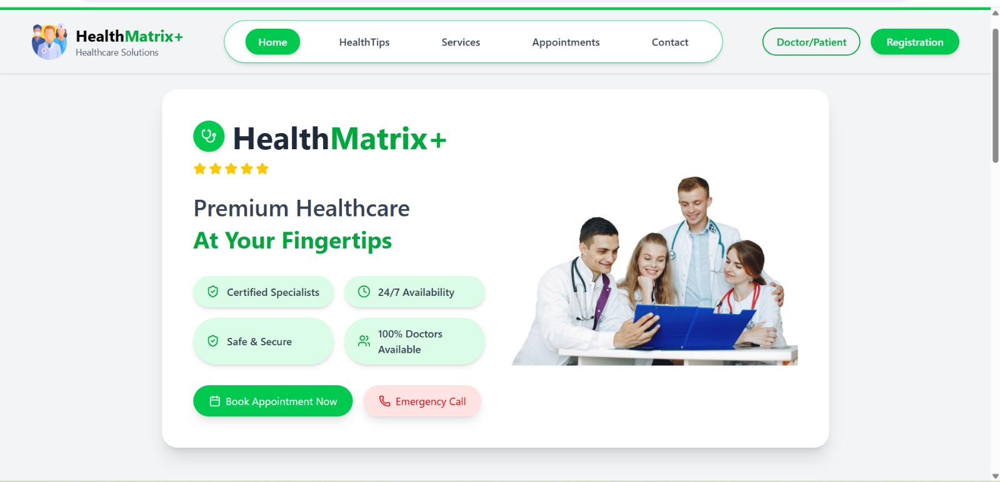
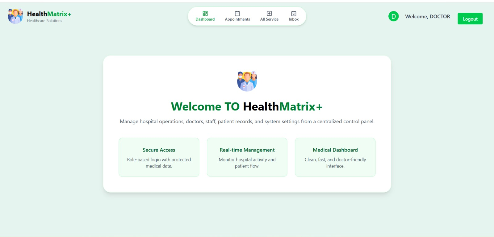

# HealthMetrix

HealthMetrix is a modern healthcare web page designed to simplify communication between patients and healthcare providers. The platform allows users to send messages, manage health-related information, and interact through a clean and user-friendly interface.

The main goal of this project is to create a simple, responsive, and efficient healthcare website using the MERN stack.

---

Click Here to visit our website [Click Here](https://icp12-group-project-5-mern-stack-1l70.onrender.com)

---

## Preview
- Home Page


- Dashboard Image


- Appointment Page
 

---

## Features

- User friendly interface
- Patient to admin messaging system
- Secure backend using Node.js and MongoDB
- REST API integration
- Responsive design for all devices
- Clean and structured frontend using React
- Real time data storage

---

## Tech Stack

Frontend:
- React.js
- CSS
- JavaScript
- Axios

Backend:
- Node.js
- Express.js

Database:
- MongoDB

Tools:
- Git
- GitHub
- MongoDB Compass / Atlas
- VS Code

---

## Installation and Setup

Clone the repository

```
git clone 
```

Go to project directory

```
cd healthmetrix
```

Install frontend dependencies

```
npm install
```

Install backend dependencies

```
npm install
```

Run frontend

```
npm run dev
```

Run backend

```
npm start
```

---

# Folder Structure

- `client/` - Frontend files

- `client/scr/assets` - Images Folder

- `client/scr/components` - Component Folder where the we files which can be used in any page 

- `client/scr/config` -  config folder where we can add new data for the frontend

- `client/scr/view` - Pages files

- `client/scr/view/auth` - Authentication page like LogIn or SignUp

- `client/scr/view/doctor` - Pages designed for Doctor

- `client/scr/view/doctor` - Pages designed for Doctor
- `client/scr/view/patient` - Pages designed for Patient

- `server/` - Backend files

- `server/controller` - Controller folder

- `server/middlewaresr` - Middlewares folder

- `server/models` - Models folder to store data in database

---
# Contributors 

<a href="https://github.com/OmKadam-1/icp12-group-project-5-MERN-stack-HealthMatrix/graphs/contributors">
  
</a>